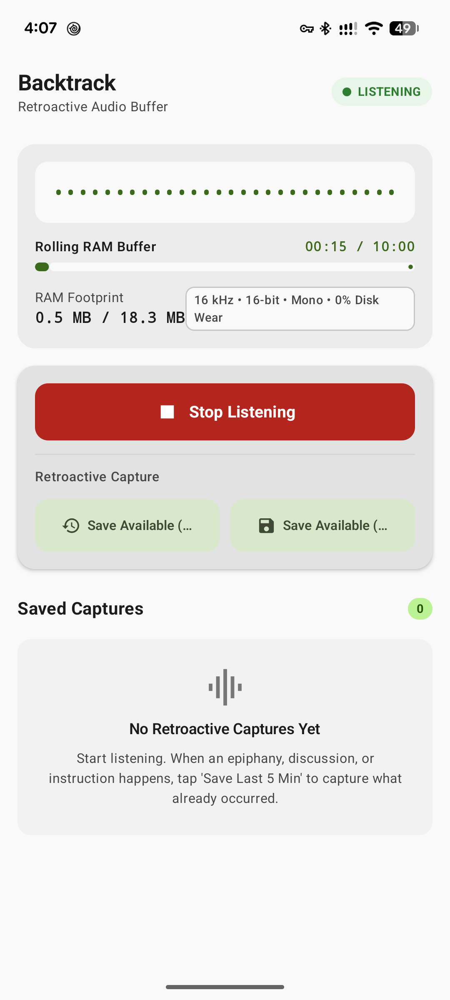
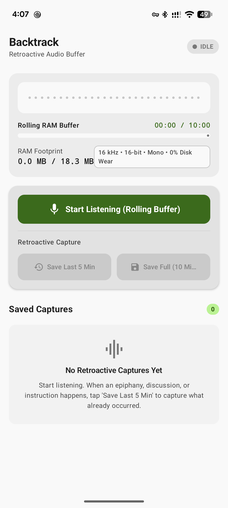
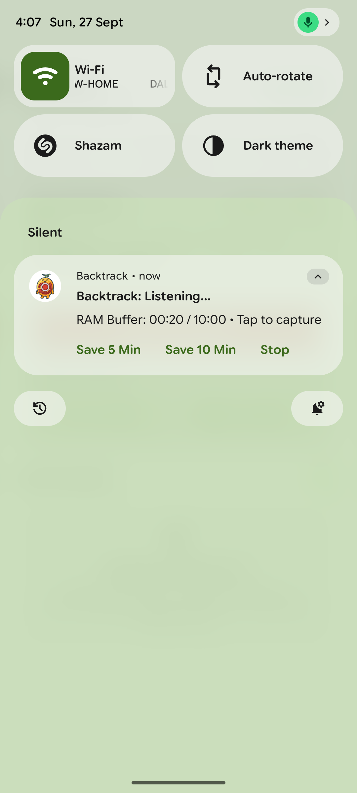
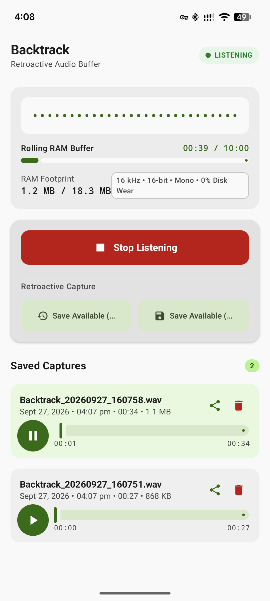

# ⏪ Backtrack (Retroactive Audio Recorder)

<p align="center">
  
</p>

<p align="center">
  <b>The audio recorder that listens into the past. Capture breakthrough moments after they happen.</b>
</p>

<p align="center">
  
  
  
  
  
  
</p>

---

## 💡 The Philosophy: Retroactive vs. Predictive Recording

Most voice recorders require **predictive intent**: you must decide to record *before* an important moment happens. But in real life, the most critical audio moments occur unannounced:
- A spontaneous creative epiphany while talking to yourself on your commute.
- A sudden breakthrough whiteboard discussion with a colleague that turns into architecture planning.
- Crucial verbal agreements or complex off-hand instructions you didn't anticipate needing notes on.

By the time you unlock your phone, find an app, and tap record, **the moment is already gone**.

**Backtrack flips this paradigm.** It continuously buffers audio in a transient, rolling RAM cache.
- **If nothing noteworthy happens:** The audio simply evaporates, overwritten in memory with **zero wear on your phone's flash storage**.
- **When something noteworthy happens:** Tap **"Save Last 5 Min"** or **"Save Full Buffer (10 Min)"** to retroactively crystallize what already occurred into high-quality `.wav` audio.

---

## 📱 Visual Showcase & Screenshots

<table align="center">
  <tr>
    <td align="center" width="25%">
      <b>1. Clean Dashboard (Idle)</b><br/><br/>
      <br/><br/>
      <sub>Minimalist Material 3 interface showing live RAM footprint and zero disk wear guarantee.</sub>
    </td>
    <td align="center" width="25%">
      <b>2. Active RAM Buffering</b><br/><br/>
      <br/><br/>
      <sub>Real-time waveform, live buffer progress meter, and adaptive retroactive capture triggers.</sub>
    </td>
    <td align="center" width="25%">
      <b>3. Lock Screen / Shade</b><br/><br/>
      <br/><br/>
      <sub>Save the last 5 or 10 minutes right from the notification shade without unlocking the phone.</sub>
    </td>
    <td align="center" width="25%">
      <b>4. In-Line Player & Sharing</b><br/><br/>
      <br/><br/>
      <sub>Listen back with interactive scrubbers and share to AI transcribers (Whisper/Gemini) in one tap.</sub>
    </td>
  </tr>
</table>

---

## 🌟 Key Features

- 🧠 **Zero Flash Storage Wear**: All rolling audio lives exclusively in a synchronized RAM ring buffer. Your flash memory is only touched when you explicitly save a capture.
- ⚡ **One-Tap Retroactive Save**: Grab the preceding 5 or 10 minutes of conversation on demand.
- 🚗 **Lock Screen & Shade Actions**: Never fumble with app locks while driving or walking. Notification actions let you save audio instantly.
- 🔋 **Battery Efficient & Doze-Resistant**: Uses an efficient `AudioRecord` read loop with `PARTIAL_WAKE_LOCK` and battery optimization exemption guidance so OEM battery killers won't kill your buffer.
- 📞 **Intelligent Audio Focus Handling**: Automatically pauses recording when a regular cellular phone call, video camera, or voice assistant is active, and resumes immediately after.
- 🎧 **Standard 44-byte RIFF/WAVE Format**: Saves pristine 16 kHz 16-bit Mono `.wav` files—the industry-standard format required by transcription engines (OpenAI Whisper, Google Cloud Speech-to-Text, local LLMs).
- 🎵 **Built-In In-Line Player**: Scrub, seek, preview, and manage your captures directly within the app.
- 📤 **Instant Android Share Sheet**: Share `.wav` files to Google Drive, Telegram, WhatsApp, Slack, or local transcription tools using secure `FileProvider` URIs.

---

## 🏗️ High-Level Technical Architecture

```
[Hardware Mic] 
      │ (Raw 16-bit PCM Stream via AudioRecord @ 16 kHz Mono)
      ▼
[BacktrackService] ── (PARTIAL_WAKE_LOCK & AudioFocus Listener)
      │
      ▼
[AudioRingBuffer (RAM)] ── Capacity: 10 mins (~19.2 MB)
      │                   Continuous FIFO Overwrite
      │
      ├── Actions: "Save Last 5 Min" / "Save Full Buffer (10 Min)"
      ▼
[WavExporter] ── Synthesize standard 44-byte RIFF/WAVE header
      │
      ▼
[Storage Engine] ── Write to app-specific Recordings directory (.wav)
      │
      ▼
[Jetpack Compose UI & Notification] ── Live Waveform, Scrubber Player, File Sharing
```

---

## 🔬 Audio Engineering Specs

| Parameter | Specification | Notes |
| :--- | :--- | :--- |
| **Sampling Rate** | 16,000 Hz (16 kHz) | Optimal benchmark for speech recognition & transcription |
| **Bit Depth** | 16-bit Linear PCM | High dynamic range, low CPU overhead |
| **Channels** | 1 (Mono) | Lightweight memory footprint |
| **Data Rate** | 32,000 bytes/sec | $16{,}000 \times 2 \text{ bytes} = 32\text{ KB/s}$ |
| **5-Minute Slice** | 9,600,000 bytes | ~9.15 MB in RAM |
| **10-Minute Buffer** | 19,200,000 bytes | ~18.31 MB in RAM (strict cap) |
| **Export Format** | Uncompressed RIFF/WAVE | Standard 44-byte header prepended on write |

---

## 🚀 Use Cases: Why You'll Love This

- 🎙️ **Spontaneous Brainstorms & Commuting**: Talk aloud in your car or during walks. If you land on a brilliant thought, tap "Save Last 5 Min" from your lock screen.
- 💻 **Engineers & Whiteboarding**: Never stop a flowing technical conversation to say *"Hold on, let me start recording"*. Just save it after the breakthrough happens.
- 📝 **Interviews, Meetings & Verbal Agreements**: Keep an invisible safety net for spoken action items, requirements, or client instructions.
- 🤖 **AI Transcription Feeder**: Drop the generated `.wav` straight into your favorite transcription or summarization pipeline.

---

## 🛠️ Perfect Template for Your Own Projects

Backtrack is architected as a clean, modular open-source template. You can easily fork it to build:
- **On-Device AI Memory Agent**: Hook local speech-to-text (e.g. Whisper.tflite / ONNX / Gemini Nano) into the RAM buffer for automated rolling summarization.
- **Wearable / Dashcam Companion**: Adapt the circular audio buffer logic for dashcams, smart glasses, or IoT audio recorders.
- **Audio Surveillance / Wildlife Monitoring**: Trigger exports on acoustic activity detection or ML sound classification.

---

## 📂 Project Structure

```
app/src/main/java/com/melonapp/an_rewind_recorder/
├── audio/
│   ├── AudioConstants.kt          # Spec constants (16kHz, buffer math)
│   ├── AudioRingBuffer.kt         # Thread-safe rolling RAM circular buffer
│   └── WavExporter.kt             # RIFF/WAV header encoder & file persistence
├── service/
│   ├── BacktrackService.kt        # Foreground mic service, WakeLock & AudioFocus
│   └── BacktrackState.kt          # Reactive StateFlow communication bridge
├── util/
│   ├── AudioPlayerManager.kt      # MediaPlayer controller with scrubbing & seek support
│   ├── BatteryOptimizationHelper.kt # Doze mode / battery exemption helper
│   ├── NotificationHelper.kt      # Persistent notification & lock-screen actions
│   ├── RecordingsRepository.kt    # File indexing, metadata, and FileProvider sharing
│   └── VibrationHelper.kt         # Haptic confirmation on capture
└── ui/
    ├── BacktrackScreen.kt         # Jetpack Compose UI (Dashboard, Waveform, Controls, Player)
    └── BacktrackViewModel.kt      # ViewModel orchestrating service, repository, and player
```

---

## ⚡ Getting Started

### Prerequisites
- Android Studio Ladybug (or newer)
- Android SDK 35/36
- Device or Emulator running Android 11+ (API 30+)

### Building from Source

```bash
# Clone the repository
git clone https://github.com/your-username/an-rewind-recorder.git
cd an-rewind-recorder

# Run unit tests
./gradlew testDebugUnitTest

# Build debug APK
./gradlew assembleDebug
```

The compiled APK will be located at:
`app/build/outputs/apk/debug/app-debug.apk`

---

## 🤝 Contributing

Contributions, issues, and feature requests are very welcome!
1. Fork the Project
2. Create your Feature Branch (`git checkout -b feature/AmazingFeature`)
3. Commit your Changes (`git commit -m 'Add some AmazingFeature'`)
4. Push to the Branch (`git push origin feature/AmazingFeature`)
5. Open a Pull Request

---

## 📄 License

Distributed under the **MIT License**. See `LICENSE` for more information.

---

<p align="center">
  <b>⭐ If you find Backtrack useful as an app or template, please give it a star! ⭐</b>
</p>
